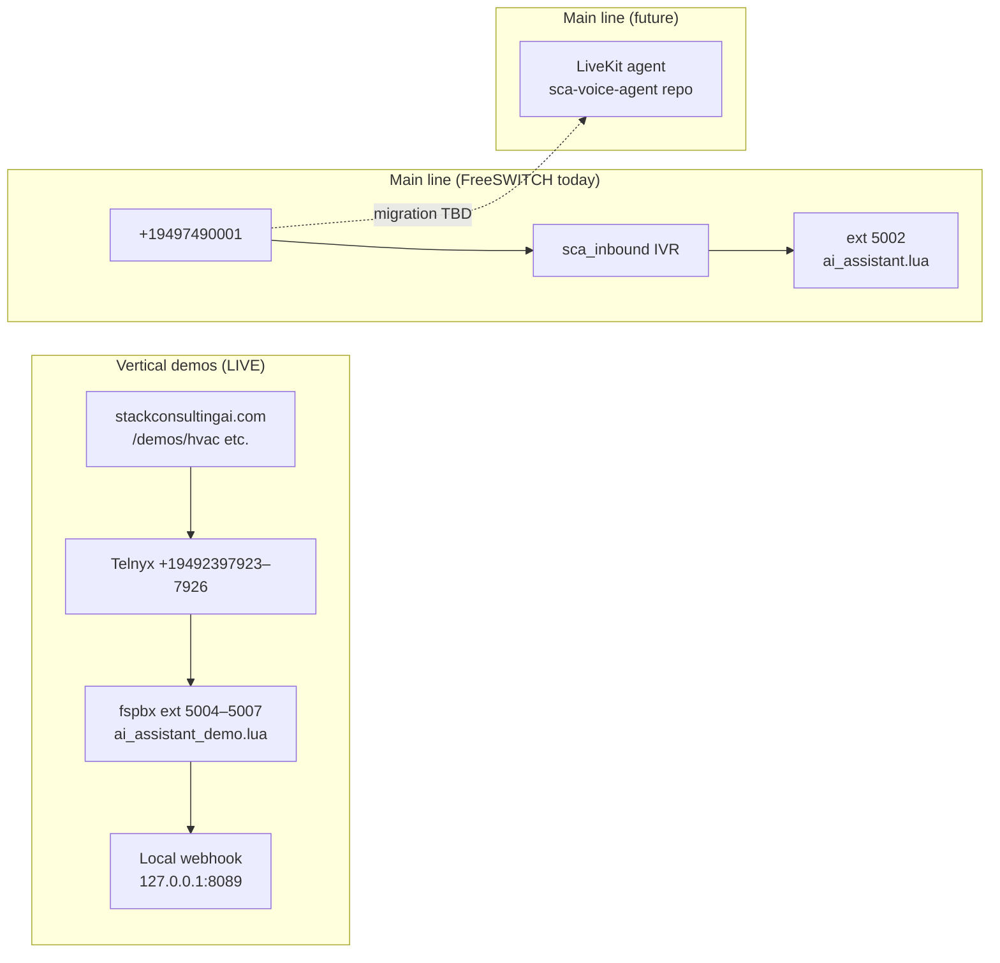

# Phone System Handoff — stackconsultingai.com

**Last updated:** 2026-07-06  
**Audience:** Claude / Cursor sessions picking up voice demo or PBX work.

---

## TL;DR

Stack Consulting AI runs **two phone stacks**:

1. **FreeSWITCH vertical demos (live today)** — Telnyx DIDs → fspbx extensions 5004–5007, website funnel at `/demos/{hvac,plumbing,auto,medspa}`, SMS verify via Telnyx, local webhook reports on PBX.
2. **LiveKit AI receptionist (future main line)** — separate repo `sca-voice-agent`; see pointer doc only.

Main SCA inbound line **949-749-0001** (`+19497490001`) → FusionPBX `sca_inbound` IVR → ext **5002** (OpenAI Realtime). Vertical demo DIDs are a separate 949-239-792x block purchased 2026-05-28.

**Outbound "Call Me" is NOT mounted** — `CallMeDemo.tsx` exists but is deferred as Task 3b.

---

## Two stacks (don't conflate them)



| Stack | Status | Doc pointer |
|-------|--------|-------------|
| FreeSWITCH vertical demos | Production | This file + `docs/pbx-operations.md` |
| FreeSWITCH main line (5002) | Production | `docs/pbx-operations.md` |
| LiveKit AI receptionist | Built in separate repo, not on live DID | `docs/sca-voice-agent-RESUME.md` |
| Stacks Assessment (ext 5003) | Separate product, NOT HVAC | `docs/HANDOFF.md` |

---

## Phone demos on stackconsultingai.com

Four distinct paths — do not merge them in copy or routing:

| Path | URL / entry | Component / API | Direction | Status |
|------|-------------|-----------------|-----------|--------|
| **1. Inbound reveal (Demo 01)** | `/demos#demo-call` | `InboundDemoReveal` → `POST /api/demos/reveal` | Inbound to **+19497490001** | Live |
| **2. Vertical funnel (Demo 04)** | `/demos/hvac`, `/demos/plumbing`, `/demos/auto`, `/demos/medspa` | `VerticalDemoFunnel` → `/api/demos/start`, `/api/demos/verify` | Inbound to vertical DID after SMS | Live |
| **3. Homepage CTA** | `/` (DemosCTA section) | Links to `/demos` | — | Live |
| **4. Outbound Call Me** | Was planned for homepage / `/demos` | `CallMeDemo` → `/api/demos/call` or `/api/call-me` | Outbound originate | **Deferred (Task 3b)** — component exists, **not mounted** |

### Vertical funnel flow

```
Questionnaire
  → Cloudflare Turnstile (only when BOTH keys set)
  → POST /api/demos/start (stores demo_leads, sends SMS code)
  → POST /api/demos/verify (checks code, reveals DID)
  → Visitor tap-to-calls vertical DID
  → fspbx ai_assistant_demo.lua
  → Local report via ai_webhook_server.py :8089 (NOT website /api/call-ended)
```

Turnstile fix merged to **main** (commit `0328c81`): API enforces Turnstile only when **both** `TURNSTILE_SECRET_KEY` and `NEXT_PUBLIC_TURNSTILE_SITE_KEY` are set. Secret-only skips bot check. Widget renders when public key is present at build time. Redeploy Vercel after adding the public key.

---

## Telnyx inventory (949 Newport Beach block)

Purchased 2026-05-28. SMS + Voice + HD Voice enabled.

| E.164 | Role |
|-------|------|
| `+19492397922` | SMS sender (verification codes + DID-reveal texts) |
| `+19492397923` | HVAC inbound → ext **5007** |
| `+19492397924` | Plumbing inbound → ext **5004** |
| `+19492397925` | Auto inbound → ext **5005** |
| `+19492397926` | Medspa inbound → ext **5006** |

### 10DLC (2026-06-09)

| Field | Value |
|-------|-------|
| Brand | Stack Consulting AI |
| TCR ID | `C70VRIQ` |
| Telnyx campaign ID | `4b30019e-9b92-3d7b-8055-906cc08a4b56` |
| Status | `MNO_PROVISIONED` |

**Human step:** assign `+19492397922` to the campaign in Telnyx portal → Messaging → 10DLC.

---

## PBX extension map (fspbx)

Host: `107.175.53.217` / Tailscale `100.78.119.28` (`fspbx`).  
Dialplans: **Postgres `v_dialplans` + `/var/cache/fusionpbx/`** — NOT `/etc/freeswitch/dialplan/*.xml`.

| Ext | Name | Script | Notes |
|-----|------|--------|-------|
| 5002 | ai-assistant | `ai_assistant.lua` | Main SCA line after IVR; OpenAI Realtime |
| 5003 | stacks-assessment | `stacks_assessment.lua` | **AI Tools Assessment — NOT HVAC** |
| 5004 | demo-plumbing | `ai_assistant_demo.lua` | Plumbing vertical |
| 5005 | demo-auto | `ai_assistant_demo.lua` | Auto vertical |
| 5006 | demo-medspa | `ai_assistant_demo.lua` | Medspa vertical |
| 5007 | demo-hvac | `ai_assistant_demo.lua` | HVAC vertical |

Public DID routing (Telnyx → FusionPBX):

| DID | Routes to |
|-----|-----------|
| 949-749-0001 | `sca_inbound` IVR → 5002 |
| 949-239-7923 | 5007 |
| 949-239-7924 | 5004 |
| 949-239-7925 | 5005 |
| 949-239-7926 | 5006 |

Vertical agents verified **2026-06-05**. Live call reports use local webhook (`ai_webhook_server.py` on `127.0.0.1:8089`), not website `/api/call-ended`.

---

## Vercel env checklist

See `.env.local.example`. Production vars in Vercel → Environment Variables → redeploy after changes.

| Variable | Required for | Notes |
|----------|--------------|-------|
| `TELNYX_API_KEY` | Vertical SMS | Messaging API key |
| `TELNYX_SENDER_NUMBER` | Vertical SMS | `+19492397922` |
| `DEMO_DID_HVAC` | HVAC reveal | `+19492397923` |
| `DEMO_DID_PLUMBING` | Plumbing reveal | `+19492397924` |
| `DEMO_DID_AUTO` | Auto reveal | `+19492397925` |
| `DEMO_DID_MEDSPA` | Medspa reveal | `+19492397926` |
| `TURNSTILE_SECRET_KEY` | Bot check | Enforced only with public key |
| `NEXT_PUBLIC_TURNSTILE_SITE_KEY` | Bot check widget | **Rebuild required** when added |
| `DEMO_INTERNAL_SECRET` | FS bridge lookup | `GET /api/demos/verify` with `X-Internal-Secret` |
| `NEXT_PUBLIC_SUPABASE_URL` | Lead storage | — |
| Supabase service role | `demo_leads` writes | Server-side only (not in example file) |

Unset `DEMO_DID_*` → verify endpoint returns `503`. Unset Telnyx → SMS codes log to server console (dev only).

---

## Completed work log

| Date | Work |
|------|------|
| 2026-05-28 | Vertical funnel shipped: 4 landing pages, `demo_leads` migration, Telnyx DIDs purchased |
| 2026-06-05 | PBX extensions 5004–5007 + DID routes verified; local webhook report path confirmed |
| 2026-06-09 | Telnyx 10DLC `MNO_PROVISIONED` (TCR `C70VRIQ`) |
| 2026-07-05 | `/demos` KB RAG, DemosCTA homepage section, truthful copy + a11y polish |
| 2026-07-06 | Task 3 inbound path reconciled; Task 5 closed (live URL confirmed); Turnstile fix merged to main (`0328c81`) |

---

## Smoke tests

### Vertical funnel (end-to-end)

1. Open https://stackconsultingai.com/demos/hvac
2. Complete questionnaire with real email + mobile
3. Solve Turnstile (if both keys set in prod)
4. Receive SMS code, enter on page
5. DID reveals — tap to dial
6. Agent answers, walk through script, hang up
7. Branded report email in ~60–90s (via PBX local webhook, not Vercel)
8. Supabase: `select id, vertical, sms_verified_at from demo_leads order by created_at desc limit 5;`

### Inbound Demo 01 (`/demos`)

1. Open https://stackconsultingai.com/demos#demo-call
2. Submit lead form → number **949-749-0001** reveals
3. Call from submitted phone → IVR → ext 5002 AI assistant

### Regression checks

- `/demos` loads (Lighthouse / manual)
- Turnstile: with secret-only, funnel works without widget token
- With both Turnstile keys, submit blocked until widget solved

---

## Open items / human actions

| Item | Owner | Notes |
|------|-------|-------|
| Assign `+19492397922` to 10DLC campaign | Chad | Telnyx portal |
| Confirm all Telnyx + Turnstile env vars in Vercel prod | Chad | Redeploy after public Turnstile key |
| Task 3b: mount outbound `CallMeDemo` + real FS originate | Dev | Not on homepage or `/demos` |
| Wire vertical reports to `/api/call-ended` + Supabase summaries | Dev | Optional; local webhook works today |
| Cost ceiling autosuspend (`DEMO_DAILY_DOLLAR_CAP`) | Dev | Phase 1C task 17 — not wired |
| LiveKit migration for main line | Dev | See `docs/sca-voice-agent-RESUME.md` |
| Motion/perf audit on `/demos` | Dev | Deferred from Task 5 |

---

## Key file map

| Area | Path |
|------|------|
| Vertical funnel UI | `components/demos/VerticalDemoFunnel.tsx` |
| Turnstile widget | `components/TurnstileWidget.tsx` |
| Inbound Demo 01 UI | `components/demos/InboundDemoReveal.tsx` |
| Outbound UI (deferred) | `components/demos/CallMeDemo.tsx` |
| Homepage demos CTA | `components/DemosCTA.tsx` |
| `/demos` page | `app/demos/page.tsx` |
| Vertical pages | `app/demos/[vertical]/page.tsx` |
| Funnel start API | `app/api/demos/start/route.ts` |
| SMS verify + FS bridge | `app/api/demos/verify/route.ts` |
| Main line reveal API | `app/api/demos/reveal/route.ts` |
| DB migration | `migrations/20260528_demo_leads.sql` |
| SMS helper | `lib/sms.ts` |
| Env template | `.env.local.example` |
| PBX ops runbook | `docs/pbx-operations.md` |
| Vertical funnel checklist | `docs/vertical-demo-funnel-handoff-2026-05-28.md` |
| Task tracker | `TASKS.md` |

---

## Related docs

| Doc | Purpose |
|-----|---------|
| [`docs/pbx-operations.md`](./pbx-operations.md) | FusionPBX gotchas, extension SQL, DID routing, outage history |
| [`docs/vertical-demo-funnel-handoff-2026-05-28.md`](./vertical-demo-funnel-handoff-2026-05-28.md) | Step-by-step vertical funnel provisioning checklist |
| [`docs/freeswitch-vertical-demo-setup-2026-05-28.md`](./freeswitch-vertical-demo-setup-2026-05-28.md) | PBX-side vertical agent setup notes |
| [`docs/sca-voice-agent-RESUME.md`](./sca-voice-agent-RESUME.md) | LiveKit receptionist (separate repo) — future main-line replacement |
| [`docs/HANDOFF.md`](./HANDOFF.md) | AI Tools Assessment (ext 5003) — separate from vertical demos |
| [`TASKS.md`](../TASKS.md) | Demos + portal master task list |
